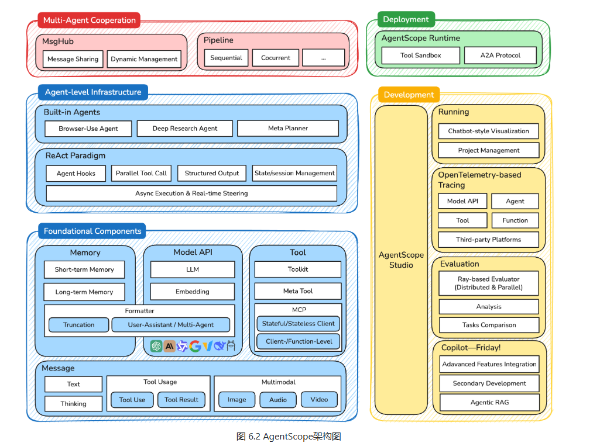

# 第六章 框架开发实践
## 6.1 从手动实现到框架开发
框架的本质是提供一套经过验证的规范。将所有智能体共有的、重复性的工作（如循环、状态管理、工具调用、日志记录等）进行抽象和封装，让我们在构建新的智能体时，专注于独特的业务逻辑，而非通用的底层实现。
### 6.1.1 为何需要智能体框架
使用框架的价值主要在几个方面：
- 提升代码复用和效率：最直接的价值。好的框架会提供通用的Agent基类或执行器，封装了智能体运行的核心循环（Agent Loop）。无论是ReAct还是Plan-and-Solve，都可以基于框架提供的标准组件快速搭建。
- 实现核心组件的解耦和可扩展性：一个健壮的智能体系统应该由多个松散耦合的模块组成。框架的设计会强制我们分离不同的关注点：
  - 模型层（Model Layer）：负责与大模型交互，可以轻松替换不同模型
  - 工具层（Tool Layer）：提供标准化的工具定义、注册和执行接口，添加新工具不会影响其它代码。
  - 记忆层（Memory Layer）：处理短期和长期记忆，根据需求切换不同的记忆策略（如滑动窗口、摘要记忆）。
- 标准化复杂的状态管理：真实的、长时运行的智能体应用中，状态管理需要处理上下文窗口的限制、历史信息持久化、多轮对话状态跟踪等问题。一个框架可以提供一套强大且通用的状态管理机制。
- 简单可观测与调试过程：一个精心设计的框架可以内置强大的可观测性能力。

### 6.1.2 主流框架选型与对比
- AutoGen：核心思想是通过对话实现协作。将多智能体系统抽象为由多个可对话智能体组成的群聊。开发者可以定义不同的角色，并设定他们的交互规则。任务的解决过程，就是这些智能体在群聊中通过自动化消息传递，不断对话、协作、迭代直至最终目标达成的过程。
- AgentScope：是转为多智能体设计的、功能全面的开发平台。核心特点是易用性和工程化。提供了非常友好的编程接口。内置的消息传递机制和对分布式部署的支持，使其适合构建和运维复杂、大规模的多智能体系统。
- CAMEL：提供角色扮演协作方法。只需要为两个智能体设定好角色和共同的任务目标，它就能在“初始提示（Inception Prompting）”的引导下自主进行多轮对话，相互启发、配合，共同完成任务。降低了多智能体对话流程的复杂度。
- LangGraph：作为LangChain生态的扩展，将智能体流程设计为图（Graph）。LangGraph将每一步操作定义为图中的一个节点（Node），并用边（Edge）定义节点之间的跳转逻辑。这种设计天然支持循环（Cycle），使得实现如Reflection这样的迭代、修正、自我反思的复杂工作流变得简单和直观。


## 6.2 框架一：AutoGen

### 6.2.1 AutoGen的核心机制
#### （1）框架演进
- 分层设计：框架被拆分为两个核心模块：
  - autogen-core：作为框架的底层基础，封装了与语言模型交互、消息传递等核心功能。保证了框架的稳定性和未来扩展性。
  - autogen-agentchat：构建与core之上，提供了用于开发对话式智能体应用的高级接口，简化了多智能体应用的开发流程。这种分层策略使得各组件职责明确，降低了系统的耦合度。
- 异步优先：新架构全面转向异步编程（async/await）。在多智能体协作场景下，网络请求是主要耗时操作。异步模式允许系统在等待一个智能体响应时处理其他任务，从而避免了线程阻塞。

#### （2） 核心智能体组件
- AssistantAgent（助理智能体）：这是任务的主要解决者，其核心是封装了一个大模型。职责是根据对话历史生成富有逻辑和知识的回复。根据不同的系统消息（System Message），可以为其赋予不同专家角色。
- UserProxyAgent（用户代理智能体）：这是AutoGen中独特的组件。扮演双重角色：既是人类用户的代言人，负责发起任务和传达意图；又是一个可靠的执行器，可以配置为执行代码或调用工具，并将结果反馈给其他智能体。这种设计清晰地区分了“思考”（由AssistantAgent完成）与“行动”

#### （3）从GroupChatManager到Team
早期，通过GroupChatManager负责协调多个智能体的对话流程。新架构（0.7.4）引入更灵活的Team或群聊概念，例如RoundRobinGroupChat。
- 轮询群聊（RoundRobinGroupChat）：明确的、顺序化的对话协调机制。让参与智能体按预定义的顺序发言。适合流程固定的任务。
- 工作流：
  - 首先创建一个RoundRobinGroupChat实例，并让所有参与协作的智能体加入。
  - 当一个任务开始时，群聊按照预设顺序，依次激活相应的智能体。
  - 被选中智能体根据当前对话上下文进行响应。
  - 群聊将新的回复加入对话历史，并激活下一个智能体。
  - 整个过程会持续进行，直到达到最大对话轮次或满足预设的终止条件。
  


### 6.2.2 软件开发团队

### 6.2.3 核心代码实现

### 6.2.4 AutoGen的优势与局限性分析

#### （1）优势
- 将完整的软件开发流映射为不同角色之间的对话。更贴近人类团队协作模式，降低了为复杂任务建模的门槛。
- 框架允许通过系统消息（System Message）为每个智能体赋予高度专业的角色。精心设计的智能体可以被不同项目复用，易于维护和扩展。
- 对于流程化任务，RoundRobinGroupChat机制提供了清晰、可预测的协作流程。UserProxyAgent为人类在环（Human-in-the-loop）提供了天然接口。他既可以作为任务的发起者，也可以是流程的监督者和最终验收者。确保了自动化系统始终在人类监督下。
#### （2）局限性
- 虽然RoundRobinGroupChat提供了顺序化的流程，但是基于LLM对话本质是具有不确定性。可能会产生偏离预期的回复，导致对话走向意外，甚至陷入循环。
- 当智能体团队工作结果未达预期，调试过程非常棘手。是“对话式调试”的难题。
#### （3）非OpenAI模型配置补充
在0.7.4版本中需要再OpenAIChatCompletionClient中传入模型信息字典，model_info

## 6.3 框架二：AgentScope
AgentScope体现了：工程化优先的多智能体平台。

### 6.3.1 AgentScope设计
AgentScope核心差异在于：消息驱动的架构设计和工业级的工程体系。
主要是组合式架构和消息驱动模式。

#### （1）分层架构体系

- 基础组件层（Foundational Components）：核心构建块
  - Message：统一的消息格式，支持从文本到多模块内容
  - Memory：短期和长期记忆管理
  - Model API：抽象了对大模型的调用
  - Tool：封装了智能体与外部系统的交互能力
- 智能体基础设施层（Agent-level Infrastructure）：包含了预构建的智能体（浏览器使用智能体、深度研究智能体），实现了经典的ReAct范式，支持智能体钩子、并行工具调用、状态管理等高级特性。支持**异步执行与实时控制**。
- 多智能体协作层（Multi-Agent Cooperation）：是核心创新。
  - MsgHub：消息中心，负责智能体间的消息路由和状态管理
  - Pipeline：灵活的工作流编排能力，支持顺序、并发等多种执行模式。
- 开发与部署层（Deployment & Development）：AgentScope对工程化的重视。
  - AgentScope Runtime：生产级运行时环境
  - AgentScope Studio：完整的可视化开发工具链
#### （2）消息驱动
AgentScope的核心创新在消息驱动架构。所有智能体的交互都被抽象为消息的发送和接收，而不是传统的函数调用。
```python
from agentscope.message import Msg
# 消息的标准结构
message = Msg(
  name="Alice",           
  # 发送者名称
  content="Hello, Bob!",  # 消息内容
  role="user",           
  metadata={             
    # 元数据信息
    "timestamp": "2024-01-15T10:30:00Z",
    "message_type": "text",
    "priority": "normal"
  }
)
```
将消息作为交互单元，有几个关键优势：
- 异步解耦：消息发送方和接收方在时间上解耦，无需互相等待，天然支持高并发场景。
- 位置透明：智能体无需关心另一个智能体在本地进程还是远端服务器，消息系统会自动处理路由。
- 可观测性：每一条消息都可以被记录、追踪和分析，简化了复杂系统的调试和监控。
- 可靠性：消息可以被持久化存储和重试，即使系统故障也可以保证最终一致性。

#### （3）智能体生命周期管理
每个智能体都有明确的生命周期（初始化、运行、暂停、销毁等），基于一个统一的基类AgentBase实现。开发者通常只需要关心其核心reply方法。
```python
from agentscope.agents import AgentBase

class CustomAgent(AgentBase):
    def __init__(self, name: str, **kwargs):
        super().__init__(name=name, **kwargs)
        # 智能体初始化逻辑
    
    def reply(self, x: Msg) -> Msg:
        # 智能体的核心响应逻辑
        response = self.model(x.content)
        return Msg(name=self.name, content=response, role="assistant")
    
    def observe(self, x: Msg) -> None:
        # 智能体的观察逻辑（可选）
        self.memory.add(x)
```
这种设计分离了智能体内部逻辑和外部通信，开发者只需要在reply方法中定义智能体的“思考和回应”的实现。

#### （4）消息传递机制
MsgHub是整个消息驱动架构的中枢。不仅负责消息的路由和分发，还继承了持久化和分布式通信，具备以下特点：
- 灵活的消息路由：支持点对点、广播、组播等多种通信模式。
- 消息持久化：能够自动将所有消息保存到数据库。
- 原生分布式：AgentScope的标志性特性。智能体可以被部署到不同的进程或服务器上，MsgHub会通过RPC自动处理跨节点通信。


### 6.3.2 三国狼人杀游戏

### 6.3.3 AgentScope的优势与局限性分析

## 6.4 框架三：CAMEL

### 6.4.1 CAMEL的自主协作

### 6.4.2 AI科普电子书

### 6.4.3 CAMEL的优势与局限性分析


## 6.5 框架四：LangGraph

### 6.5.1 LangGraph的结构梳理

### 6.5.2 三步问答助手

### 6.5.3 LangGraph的优势与局限性分析

