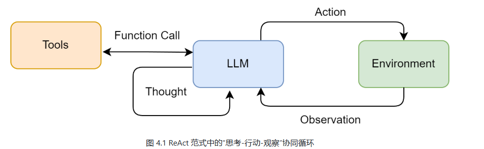
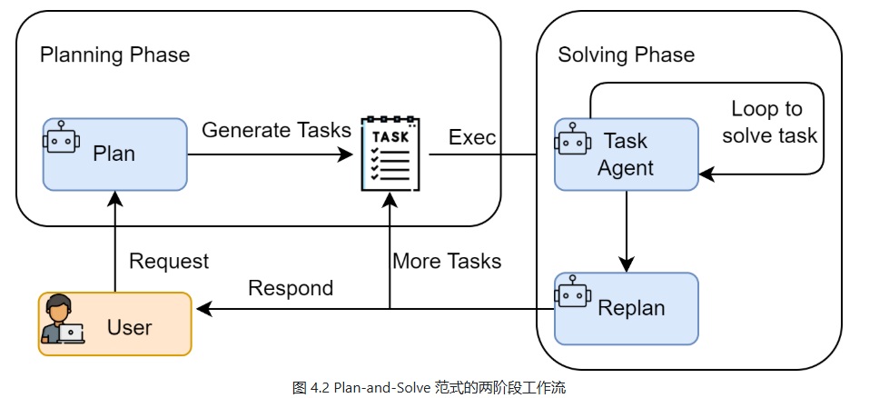
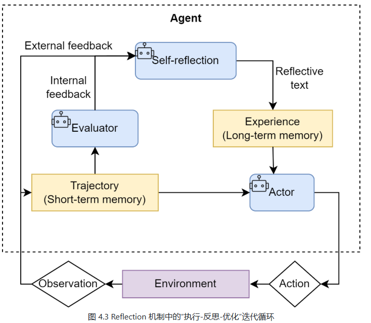

# 4. 智能体经典范式构建

现代智能体的核心能力在于能将大语言模型的推理能力和外界联通。能够自主理解用户意图、拆解复杂任务，并通过调用代码解释器、搜索引擎、API等一系列工具，获取信息、执行操作、最终达成目标。
智能体并非万能，面临来自大模型本身的幻觉、在复杂任务中可能陷入推理循环、以及对工具的错误使用等挑战，这些构成了智能体发展的边界。
为了更好组织智能体“思考”和“行动”过程，业界涌现很多经典范式。
- ReAct（Reasoning And Acting）：一种将“思考”和“行动”紧密结合的范式，让智能体边想边做，动态调整。
- Plan-And-Solve：一种“三思而后行”的范式，智能体首先生成一个完整的行动规划，然后严格执行。
- Reflection：一种赋予智能体“反思”能力的范式，通过自我批评和修正来优化结果。

## 4.2 ReAct
将推理（Reasoning）和行动（Acting）结合，形成一个“思考-行动-观察”的循环。
### 4.2.1 ReAct工作流程
在ReAct之前，主流的方法分为两类：一类是纯思考型，如思维链（Chain-Of-Thought），它能引导模型进行复杂的逻辑推理，但无法与外界进行交互，容易产生事实幻觉；另一类是纯行动型，模型直接输出要执行的动作，但缺乏规划和纠错能力。
ReAct的巧妙之处在于，它认识到**思考和行动是相辅相成的**。思考指导行动，行动结果反过来修正思考。为此，ReAct通过一种特殊的提示工程引导模型，使其每一步都遵循一个固定的轨迹。
- Thought（思考）：会分析当前情况，拆解任务，制定下一步行动计划或者反思上一步结果。
- Action（行动）：智能体决定采取的具体动作。通常是调用一个外部工具
- Observation（观察）：这是执行Actin从外部工具返回的结果。

智能体在不断循环“思考-行动-观察”的循环，将新的观察结果追加到历史记录中，形成一个不断增长的上下文，直到它在Thought中认为已经找到最终答案，然后输出结果。这个过程形成了强大的协同效应：**推理使行动更具目的性，而行动则为推理提供了事实依据。**

我们可以将这个过程形式化地表达出来，如图4.1所示。具体来说，在每个时间步 t，智能体的策略（即大语言模型 π）会根据初始问题 q 和之前所有步骤的“行动-观察”历史轨迹 ((a1，o1)
，…，(at−1，ot−1))，来生成当前的思考 tht 和行动 at：

这种机制很适合以下场景：
- 需要外部知识的任务：如查询实时天气、搜索专业领域知识等。
- 需要精确计算：将数学问题交给计算工具。
- 需要与API交互的任务：如操作数据库，调用某个服务的API完成特定的任务。

### 4.2.2 工具的定义和实现
#### （1）实现搜索工具的核心逻辑
一个良好定义的工具应该包含以下核心要素：
- 1.名称（Name）：一个简洁、唯一的标识符，供智能体在Action中调用。
- 2.描述（Description）：一段清晰的自然语言描述，说明这个工具的用途。这是整个机制中最关键的部分，因为大语言模型依赖这段描述判断何时使用哪个工具。
- 3.执行逻辑（Execution Logic）：真正执行任务的函数或方法。

### 4.2.3 ReAct智能体的编码实现
提示词模板定义了智能体和大模型之间的交互规范：
- 角色定义：“你是一个有能力调用外部工具的智能助手”，设定了LLM的角色。
- 工具清单（tools）：告诉LLM有哪些可用的“手脚”
- 格式规约（Thought、Action）：这是最重要的部分，强制LLM输出具有结构性，使我们可以通过代码解析其意图。
- 动态上下文（{question}、{history}）：将用户的原始问题和不断累积的交互历史注入，让LLM基于完整的上下文进行决策。
### 4.2.4 ReAct的特点、局限性和调试技巧
#### （1）ReAct的主要特点
- 1. 高可解释性：ReAct最大的特点就是透明。通过Thought链，可以清晰看到 为什么选择这个工具，下一个又打算做什么。对于理解、信任和调试智能体很重要。
- 2. 动态规划和纠错能力：和一次性生成完整计划的范式不同，ReAct是“走一步、看一步”。根据每一步从外界获取的Observation来动态调整后面的Thought和Action。如果上一步搜索不理想，下一步会调整搜索词重新尝试。
- 3. 工具协调能力：ReAct范式天然地将大模型和外部工具执行能力结合。LLM负责统筹帷幄（规划和推理），工具负责解决具体问题（搜索、计算），二者协同工作，突破了单一LLM在知识时效性、计算准确性等方面的固有局限。

#### （2）ReAct的固有局限
- 1. 对LLM自身能力的强依赖。ReAct流程的成功与否，高度依赖底层LLM的综合能力。如果LLM的逻辑推理能力、指令遵循能力或格式化输出能力不足，就容易在Thought环节产生错误的规划或者在Action环节生成不符合格式的指令，导致流程中断。
- 2. 执行效率问题：由于其循序渐进的特性，完成一个任务通常需要多次调用LLM。每次调用都伴随着网络延迟和计算成本。对于需要很多步骤的复杂任务，这种串行的“思考-行动”循环可能导致很高的总耗时和费用。
- 3. 提示词的脆弱性：整个机制的稳定运行建立在一个精心设置的提示词模板上。模板中的微小改动，甚至是用词的差异，都可能影响LLM的行为。此外，并非所有模型都能够持续稳定地遵循预设的格式，增加了在实际应用中的不稳定性。
- 4. 可能陷入局部最优：步进式的决策模式意味着智能体缺乏一个全局、长远的规划。可能会因为眼前的Observation选择一个看似最正确但是长远看非最优的路径，甚至在某些情况可能会出现“原地打转”的循环中。

#### （3）调优技巧
- 检查提示词的完整性：每次调用LLM前，将最终格式化好的、包含所有历史记录的完整提示词打印出来。这是追溯LLM决策源头的最直接的方式。
- 分析原始输出：当输出解析失败时（例如，正则表达式没有匹配到Action），务必将LLM返回的原始、未经处理的文本打印出来。可以帮忙辅助判断是LLM没有遵循格式，还是解析逻辑有误。
- 验证工具的输入输出：检查智能体生成的tool_input是否是工具期望的格式。同时也要确保工具输出的Observation格式是智能体可以理解和处理的。
- 调整提示词中的示例（Few-shot-Prompting）：如果模型频繁出错，可以在提示词中加入一两个完整的“Thought-Action-Observation”成功案例，通过示例引导模型更好的遵循你的指令。
- 尝试不同的模型和参数：更换一个能力更强的模型，或者调整Temperature参数（通常设置为0保证输出的确定性），有时能够解决问题。

## 4.3 Plan-and-Solve
Plan-and-Solve，顾名思义：先规划（Plan），后执行（Solve）
### 4.3.1 Plan-and-Solve的工作原理
- 1. 规划阶段（Planning Phase）：首先，智能体会接收用户完整问题。他的第一个任务不是直接去解决问题或调用工具，而是将问题分解、并制定出一个清晰、分步骤的行动计划。这个计划本身就是大模型调用产物。
- 2. 执行阶段（Solving Phase）：会严格按照计划中的步骤，逐一执行。每一次执行都可能是一次独立的LLM调用，或对上一步结果的处理，直到计划中所有的步骤都处理完成，最终得到答案。

Plan-and-Solve适合那些结构性强，可以被清晰分解的复杂任务，例如：
- 多步数学应用题
- 需要整合多个信息源的报告撰写
- 代码生成任务

### 4.3.2 规划阶段
【代码】
提示词模板设定通过以下几点保证输出的质量和稳定性：
- 角色设定：“顶级的AI规划专家”，激发模型的专业能力。
- 任务描述：清晰了定义“分解问题”的目标。
- 格式约束：强制要求输出为一个Python列表格式的字符串，极大地简化了后续代码的解析工作，使其比自然语言更稳定、更可靠。

### 4.3.3 执行器与状态管理
在规划器（Planner）完成规划后，需要执行器（Executor）逐一执行计划中任务。执行器不仅需要调用大模型解决每个子问题，还需要进行状态管理。记录每一步的执行结果，并将其作为上下文提供给后续步骤。
规划器的目标是在已有上下文基础上，专注解决当前步骤。因此，提示词需要以下信息：
- 原始问题：确保模型始终了解最终目标。
- 完整计划：让模型了解当前步骤在整个任务中位置。
- 历史步骤与结果：提供至今为止已经完成的工作，作为当前步骤的输入。
- 当前步骤：明确告知模型当前需要解决哪一个具体任务。
【代码】

Plan-and-Solve范式的工作流程：
- 1. 规划阶段：智能体首先调用Planner，将复杂的应用题分解为包含多个步骤的Python列表。
- 2. 执行阶段：Executor严格按照生成的计划一步步向下执行。每一步骤都将历史结果作为上下文，确保了信息的正确传递。
- 3. 结果：整个过程逻辑清晰步骤明确。

## 4.4 Reflection
为智能体引入一种**事后（post-hoc）的自我校正循环**，使其能像人类一样，审视自己的工作，发现不足并迭代优化。
### 4.4.1 Reflection机制的核心思想
**执行-反思-优化**
- 1. 执行（Execution）：使用我们熟悉的方法（ReAct或Plan-and-Solve）完成尝试完成任务，生成一个初步的解决方案或行动轨迹。可以认为是“初稿”。
- 2. 反思（Reflection）：智能体进入反思阶段。调用一个独立的、或者带有特殊提示词的大模型实例，来扮演一个“评审员”的角色。这个“评审员”会审视第一步生成的初稿，并从多维度进行评估，例如：
  - 事实性错误：是否存在常识或与已知事实相悖的内容。
  - 逻辑漏洞：推理过程是否存在不连贯或矛盾之处。
  - 效率问题：是否有更直接、更简洁的路径完成任务。
  - 遗漏信息：是否忽略了问题的某些关键约束或方面？
  根据评估，它会生成一段结构化的反馈（Feedback），指出具体的问题所在和改进建议。
- 3. 优化（Refinement）：最后，智能体根据“初稿”和“反馈”作为新的上下文，再次调用大语言模型，要求他根据反馈对初稿进行修正，生成一个更完善的“修订稿”。

与前两种范式相比，Reflection的价值在于：
- 为智能体提供了内部纠错回路，使其不再完全依赖于外部工具的反馈（ReAct的Observation），从而能够修正更高层次的逻辑和策略错误。
- 将一次性任务执行，转变为一个持续优化的过程，显著提升了复杂任务的最终成功率和答案质量。
- 为智能体构建了一个临时的“短期记忆”。整个“执行-反思-优化”的轨迹形成了宝贵的经验记录，智能体不仅知道最终答案，还记得自己是如何从有缺陷的初稿迭代到最终版本的。更进一步，这个记忆系统可以是多模态的，允许智能体反思和修正文本以外的输出（比如代码、图像等），为构建更强大的多模态智能体奠定了基础。

### 4.4.2 案例设定与记忆模块设计
Reflection的核心在于迭代，而迭代的前提是能够记住之前的尝试和获得的反馈。因此，一个“短期记忆”模块是实现该范式的必需品。这个记忆模块将存储每一次“执行-反思”循环的完整轨迹。

### 4.4.5 Reflection机制的成本收益分析
#### （1）主要成本
- 模型调用开销增加：最直接的成本，每进行一轮迭代，至少额外调用两次大模型（一次用于反思，一次用于优化）。
- 任务延迟显著提高：Reflection是一个串行的过程，每一轮优化都必须基于上一轮反思完成。不适合对性能要求极高的场景。
- 提示工程复杂度上升：Reflection的成功很大程度上依赖高质量，有针对性的提示词。为“执行”“反思”“优化”等不同阶段设计和调试有效地提示词，需要投入更多的精力。

#### （2）核心收益
- 解决方案质量的跃迁：能将一个“合格”的初始方案，迭代优化成一个“优秀”的最终方案。这种从功能正确到性能高效、从逻辑粗糙到逻辑严谨的提升，在很多关键任务中至关重要。
- 鲁棒性和可靠性提升：通过内部自我纠错循环，能够发现并修复初始方案中可能存在的逻辑漏洞、事实性错误或边界处理不当等问题。

综上，Reflection机制适合**对最终结果质量、准确性和可靠性有极高要求，且对任务完成时间要求宽松的场景**

